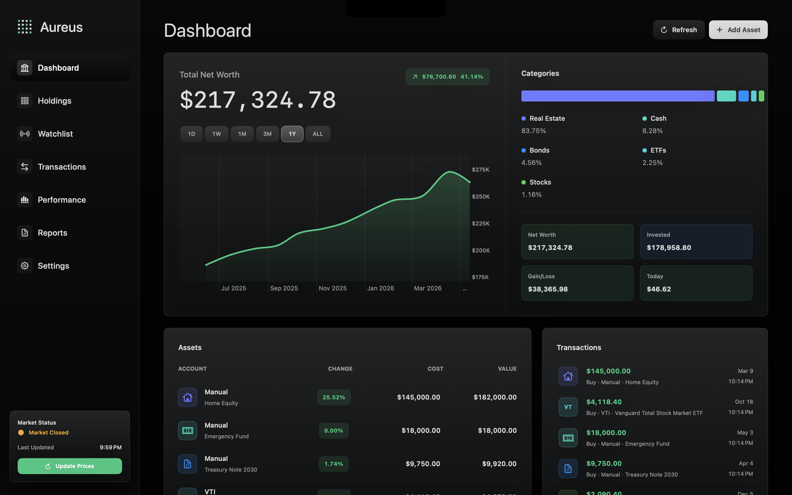
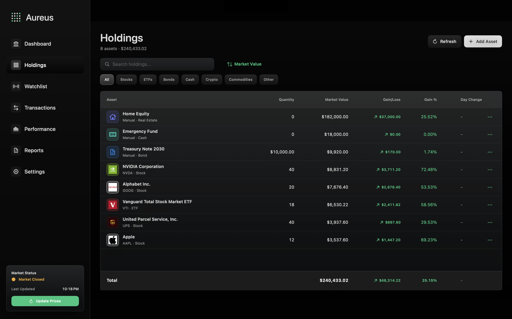
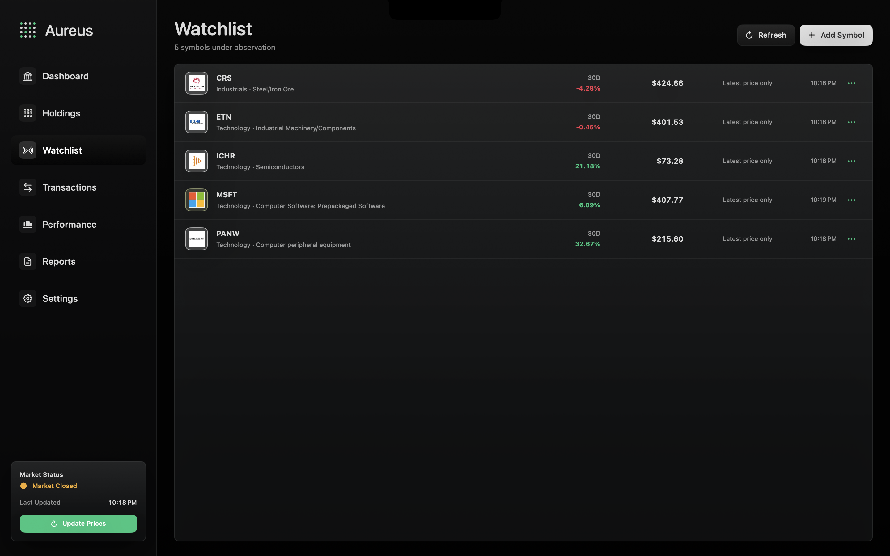
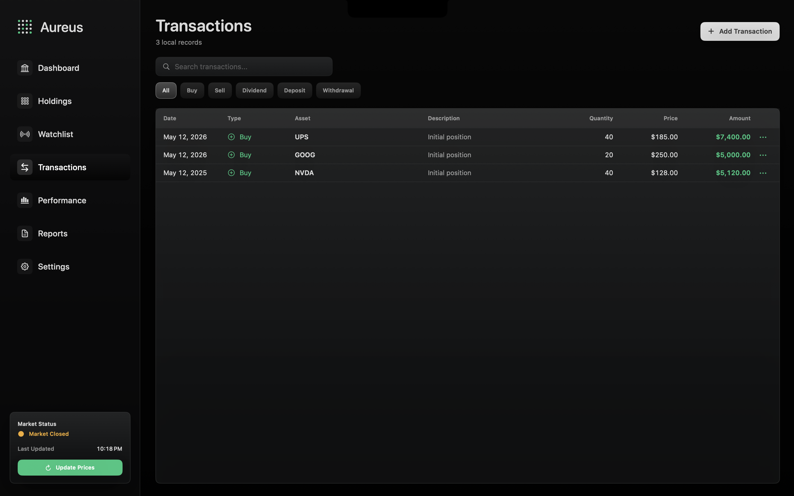
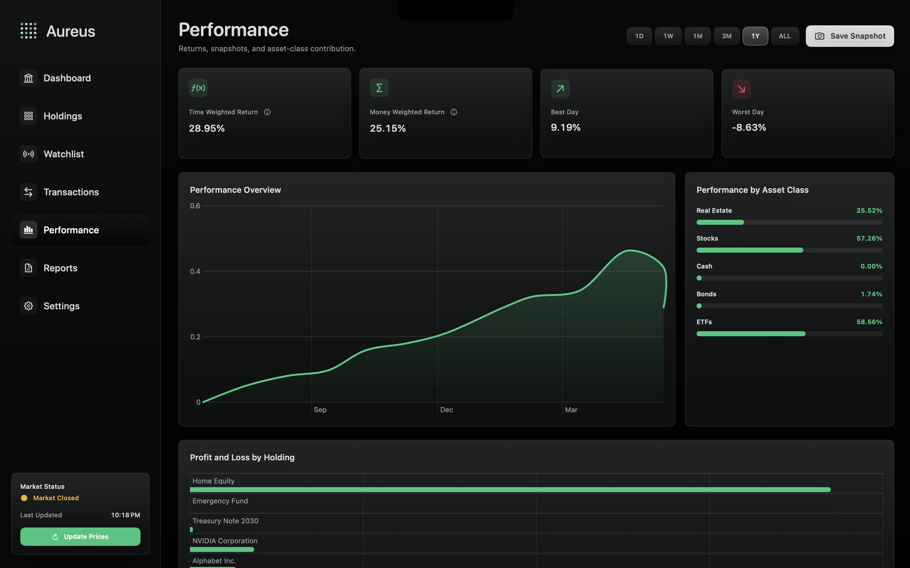

# Aureus

Aureus is a native macOS net worth tracker for people who want a private, local-first view of their whole financial picture. Track market-priced securities alongside cash, bonds, real estate, collectibles, businesses, crypto, commodities, and custom assets, then review allocation, performance, transactions, and saved snapshots from one polished SwiftUI app.



## Highlights

- Local-first portfolio tracking with SwiftData persistence for holdings, transactions, watchlist symbols, price snapshots, net worth snapshots, and preferences.
- Dashboard summary with total net worth, range-based net worth chart, allocation breakdown, asset table, and recent activity feed.
- Holdings table with search, asset-class filters, sortable market value/gain views, inline actions, sell flow, delete confirmation, and detailed asset inspection.
- Watchlist for non-owned symbols with quotes, profiles, 30-day performance, logos, and local notes.
- Transaction ledger for buys, sells, dividends, deposits, withdrawals, interest, and adjustments.
- Performance analytics with time-weighted return, money-weighted return, best/worst day, return chart, asset-class contribution, and profit/loss by holding.
- Reports for allocation, concentration, largest positions, and saved snapshot history.
- Yahoo Finance quote, profile, and historical price refresh for supported market-priced assets.
- CSV import/export, paste-based CSV import, JSON backup/restore, sample data loading, snapshot cleanup, and full local data reset.
- Dark SwiftUI interface with Apple Charts, keyboard shortcuts, and macOS-native sheets, menus, alerts, and file panels.

## Screenshots

### Dashboard

The dashboard combines total net worth, selected-range movement, portfolio allocation, asset values, and recent transactions.


### Holdings

Holdings supports search, category filters, sort modes, asset logos, cost/value/gain columns, and row actions.



### Watchlist

The watchlist keeps potential buys separate from owned assets while still refreshing market data and company profiles.



### Transactions

The transaction ledger records local activity across buys, sells, dividends, deposits, and withdrawals.



### Performance

Performance views show return metrics, charted portfolio movement, asset-class contribution, and per-holding profit/loss.



## Product Areas

### Dashboard

- Range picker for `1D`, `1W`, `1M`, `3M`, `1Y`, and `ALL`.
- Net worth area chart built from saved snapshots and market price history.
- Allocation panel grouped by asset class.
- Summary cards for net worth, invested capital, gain/loss, and daily change.
- Recent asset and transaction activity.

### Assets and Holdings

- Supported asset types: stocks, ETFs, bonds, cash, crypto, commodities, real estate, businesses, collectibles, and custom assets.
- Market-priced assets use ticker symbols, quantity, purchase price, quote refreshes, profile metadata, logos, and historical prices.
- Manual assets use cost basis, current value, fees, categories, and notes.
- Bonds support principal, purchase price, interest rate, maturity date, and current value.
- New holdings automatically create an initial transaction record.

### Watchlist

- Track symbols before buying them.
- Refresh quote, profile, logo, sector, industry, and 30-day history.
- Store watchlist items locally in SwiftData.

### Transactions

- Add, search, filter, and delete local transaction records.
- Supported transaction kinds include buy, sell, dividend, deposit, withdrawal, interest, and adjustment.
- Transaction rows show date, type, asset, description, quantity, price, and amount.

### Performance and Reports

- Time-weighted and money-weighted return calculations.
- Best and worst daily return cards.
- Return chart over the selected time range.
- Asset-class performance bars and per-holding profit/loss chart.
- Reports for allocation, concentration, largest positions, and snapshot history.
- Daily snapshot creation on app open plus manual snapshot saves.

### Data Tools

- Export holdings to CSV.
- Import holdings from CSV files or pasted CSV text.
- Export and restore JSON backups.
- Load randomized sample data for testing.
- Remove snapshots without deleting holdings.
- Clear all local holdings, watchlist symbols, transactions, snapshots, settings, and price history.

## Run

Requirements:

- macOS 14 or newer
- Xcode 16.4 or newer
- Swift 5.9 package tooling

Open `Package.swift` in Xcode, select the `Aureus` executable, and run.

From Terminal:

```sh
swift run Aureus
```

## Test

```sh
swift test
```

## Keyboard Shortcuts

- `Command-N`: add an asset
- `Command-R`: refresh prices

## Privacy

Aureus stores holdings, transactions, watchlist items, prices, snapshots, settings, imports, and backups locally on your Mac. The only network activity is optional market data refreshes for ticker symbols you choose to track, currently using Yahoo Finance endpoints for quotes, profiles, and historical prices.
